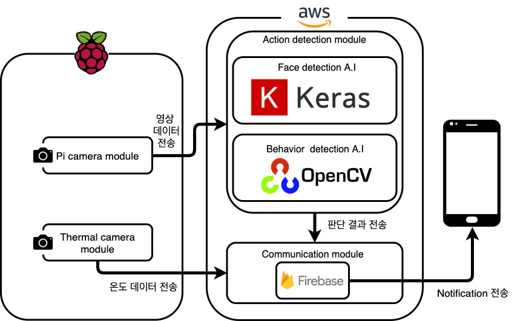

# baby care system
**질식에 의한 영아 돌연사 증후군**을 **영상처리, 인공지능**을 활용하여 방지하는 시스템 
## 핵심 기능
* 영아의 수면 자세를 인식하여 위험 요소를 판단함
* 영아의 체온을 인식하여 미열, 저체온의 위험 요소를 판단함
* 위험 요소가 발견될 시, 보호자의 스마트폰으로 알림 전송

## 시스템 설계

## 디렉토리 설명
* ./AWS
  * AWSmain.py : aws에서 동작하는 어플리케이션 main 소스
  * faceDetection.py : 얼굴 인식 서브 프로그램
  * Face.h5 : 얼굴 인신 서브 프로그램 동작 시 사용하는 파일
  * motionDection.py : 모션 인식 서브 프로그램
  * graph_opt.pb : 모션 인식 서브 프로그램 동작 시 사용하는 파일
* ./android
  * 안드로이드 어플리케이션
* ./raspberryPi
  * raspberryPiMain.py : 카메라 촬영을 담당하는 raspberryPi main 소스
